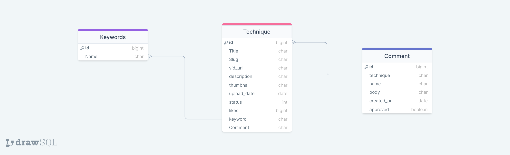

# Satori Knowledge Base

Satori Knowledge Base is an application that allows users to watch & study Brazilian Jiu Jitsu (BJJ) techniques. Users are able to register, like and comment on videos.

The application was built using the Django Framework and can be accessed [here](https://satori-knowledgebase-f34b4f67eb41.herokuapp.com/)

# Add multi device mockup image

## UX & Design

### Strategy

The purpose of this site is to allow users to access and filter a library of Brazilian Jiu Jitsu techniques. Users are able to like, comment and acces a liked videos in a minimalistc layout that focuses on users learning. Admin users are able to create, edit and delete videos all on the user facing site.

### Agile Methodology

An Agile Project Management approach was adopted from the begining of the project. User stories were created for each individual feature of the site. Each user story was broken down into acceptance criteria allowing a clear goal to be illustrated with each user story. User stories were tracked and updated throughout the development cycle with tasks being added and updated and new stories added if they arose. The user stories were tracked using a Github Project Kanban board which you can view here [here](https://github.com/users/Janisroz/projects/2)

#### Epics

The site was broken down into six epics that dealt with specific sections of the site

1. Project Set-up
   - This epic consisted of user stories that related to setting up the site and laying down the ground work that the project would be built upon such as installing django, creating the app and creating the base.html file

2. Techniques
    - This epic dealt with CRUD functionality of individual techniques and also dealt with implementation of liking and commenting features for users

3. User Management
    - This epic dealt with user authentication including site admins. This epic ensured specific users had certain rights across the site that standard users were able to interact with the site

4. Deployment
    - This epic dealt with deplotment of the site to Heroku

5. Main Page
   - This epic dealt with user stories for the home page such as search and filtering features and also included some extra details such as favicon

### The Scope Plane

#### Essential Content

- Home Page with technique list view
- Technique Page where video is displayed
- Comment & Like section on each technique page
- Option to Add, Edit and Delete Techniques for admin users
- Sign up, login and logout pages

#### Optional Content

- Liked videos page
- Search & Filter functionality on home page

### Database Structure

The database structure was developed using the django built-in models. Before development the models were defined and mapped out as a database schema that can be viewed below. 

The database was designed to allow CRUD functionality for Techniques to admin users once they are signed in.

The Technique model contains the individual techniques that can be viewed by users once published.

The Keywords model is linked to the Technique model as a many to one relationship allowing for many keywords to be applied to individual techniques.

The Comment model is linked to the Technique model as a many to one relationship allowing for many comments from multiple users to be applied to individual techniques.

### The Structure Plane

The site consists of a main home page that allows all users to view published techniques. Individual techniques can then be selected and viewed. There are also authentication and CRUD pages that will be discussed below.

### Features

#### Nav Bar

The nav bar was implemented on all pages but changed depending on authentication. On smaller devices it changes to a hamburger menu. The navbar consisted of the following items:

- Home - index.html
- Register - accounts/signup.html
- Login - accounts/login.html
- Liked Techniques - (If user is authenticated) - liked-techniques.html
- Add Technique - (If user is an admin) - add_technique.html

## Add image

#### Footer

A footer was implemented at the bottom of each page that contains links to the social media aages of the site. Links open in new tabs to ensure the best user experience and also contain aria-labels.

## Add image

#### Home Page

The main page of the site is the home page and consists of a heading informing users what the purpose of the site is. There is a search form that allows users to search for specific Techniques  or filter by keyword. Below the form there is the list view of all published techniques ordered by upload date. The list is paginated by nine posts per page.

## Add image

#### Technique Page

Each Technique has its own unique page that consists of the title, the embedded youtube video and the like and comment sections. When a user is logged in they can like the technique and leave a comment for approval. Admin users also are able to select to edit or delete the indiviual technique.

## Add image

#### Liked Technique Page 

When a user is logged in they are able to like a techniques in the techniques unique pages and then select the liked techniques link in the navbar and view the techniques that they have liked already. This feature was implemented to allow users to return to favorite videos.

## Add image

#### Add Technique Page 

When a site admin is logged in they are able to select the Add Technique link in the navbar. This link brings them to a form allowing the user to create a new technique for site users

## Add image

#### Edit Technique Page 

When a site admin is logged in they are able to select the edit Technique link on the unique Techniques page. This link brings them to a form allowing the user to edit the current technique to update or correct any information.

## Add image

#### Delete Technique Page 

When a site admin is logged in they are able to select the delete Technique link on the unique Techniques page. This link brings them to a form allowing the user to delete current technique.

## Add image

#### Sign-up page

A sign-up page was created in order to allow users to sign up to the site allowing them to like and comment on techniques.

## Add image

#### Login page

A login page was created in order to allow users to login to the site allowing them to like and comment on techniques and view their previously like techniques.

## Add image

#### Logout page

When a user is logged in they are given the option to log out in the navbar.

## Add image

#### 404 page 

A 404 page was implemented to ensure that if a user navigates to a broken link information will be displayed informing of what happened and they will be able to return to the home page.

#### 403 page 

A 403 page was implemented to ensure that if a users tries to gain accesss to restricted content they well be informed and will be able to return to the home page.This includes the following pages:

- Create Technique
- Edit Technique
- Delete Technique

#### Favicon

A favicon was implemented to ensure that the wste was easily recognizable even with multiple tabs open.

### Security

Views were secured using the LoginRequiredMixin and the UserPassesTestMixin these were used to ensure that users attempting to access specific pages were authorized. Only admins are able to access the Create, edit and delete technique pages and only logged in users could view their liked techniques.

During development environment variables were stored in an env.py for local development for security purposes to ensure no secret keys or sensitive information was added the the repository. In production, these variables were added to the heroku config vars within the project.