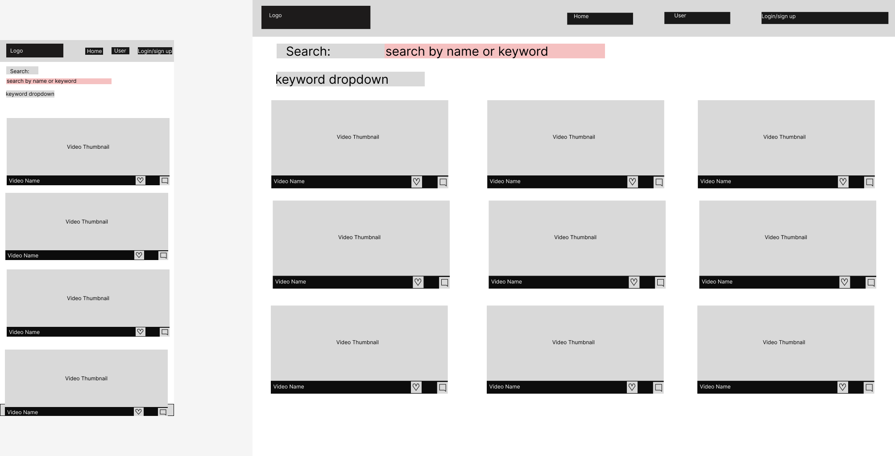

# Satori Knowledge Base

Satori Knowledge Base is an application that allows users to watch & study Brazilian Jiu Jitsu (BJJ) techniques. Users are able to register, like and comment on videos.

The application was built using the Django Framework and can be accessed [here](https://satori-knowledgebase-f34b4f67eb41.herokuapp.com/)

## UX & Design

### Strategy

The purpose of this site is to allow users to access and filter a library of Brazilian Jiu Jitsu techniques. Users are able to like, comment and acces a liked videos in a minimalistc layout that focuses on users learning. Admin users are able to create, edit and delete videos all on the user facing site.

### Agile Methodology

An Agile Project Management approach was adopted from the begining of the project. User stories were created for each individual feature of the site. Each user story was broken down into acceptance criteria allowing a clear goal to be illustrated with each user story. User stories were tracked and updated throughout the development cycle with tasks being added and updated and new stories added if they arose. The user stories were tracked using a Github Project Kanban board which you can view here [here](https://github.com/users/Janisroz/projects/2)

#### Epics

The site was broken down into six epics that dealt with specific sections of the site

1. Project Set-up
   - This epic consisted of user stories that related to setting up the site and laying down the ground work that the project would be built upon such as installing django, creating the app and creating the base.html file

2. Techniques
    - This epic dealt with CRUD functionality of individual techniques and also dealt with implementation of liking and commenting features for users

3. User Management
    - This epic dealt with user authentication including site admins. This epic ensured specific users had certain rights across the site that standard users were able to interact with the site

4. Deployment
    - This epic dealt with deplotment of the site to Heroku

5. Main Page
   - This epic dealt with user stories for the home page such as search and filtering features and also included some extra details such as favicon

### The Scope Plane

#### Essential Content

- Home Page with technique list view
- Technique Page where video is displayed
- Comment & Like section on each technique page
- Option to Add, Edit and Delete Techniques for admin users
- Sign up, login and logout pages

#### Optional Content

- Liked videos page
- Search & Filter functionality on home page

### Database Structure

The database structure was developed using the django built-in models. Before development the models were defined and mapped out as a database schema that can be viewed below.

The database was designed to allow CRUD functionality for Techniques to admin users once they are signed in.

The Technique model contains the individual techniques that can be viewed by users once published.

The Keywords model is linked to the Technique model as a many to one relationship allowing for many keywords to be applied to individual techniques.

The Comment model is linked to the Technique model as a many to one relationship allowing for many comments from multiple users to be applied to individual techniques.

### The Structure Plane

The site consists of a main home page that allows all users to view published techniques. Individual techniques can then be selected and viewed. There are also authentication and CRUD pages that will be discussed below.

### Features

#### Nav Bar

The nav bar was implemented on all pages but changed depending on authentication. On smaller devices it changes to a hamburger menu. The navbar consisted of the following items:

- Home - index.html
- Register - accounts/signup.html
- Login - accounts/login.html
- Liked Techniques - (If user is authenticated) - liked-techniques.html
- Add Technique - (If user is an admin) - add_technique.html

#### Footer

A footer was implemented at the bottom of each page that contains links to the social media aages of the site. Links open in new tabs to ensure the best user experience and also contain aria-labels.

#### Home Page

The main page of the site is the home page and consists of a heading informing users what the purpose of the site is. There is a search form that allows users to search for specific Techniques  or filter by keyword. Below the form there is the list view of all published techniques ordered by upload date. The list is paginated by nine posts per page.

#### Technique Page

Each Technique has its own unique page that consists of the title, the embedded youtube video and the like and comment sections. When a user is logged in they can like the technique and leave a comment for approval. Admin users also are able to select to edit or delete the indiviual technique.

#### Liked Technique Page

When a user is logged in they are able to like a techniques in the techniques unique pages and then select the liked techniques link in the navbar and view the techniques that they have liked already. This feature was implemented to allow users to return to favorite videos.

#### Add Technique Page

When a site admin is logged in they are able to select the Add Technique link in the navbar. This link brings them to a form allowing the user to create a new technique for site users

#### Edit Technique Page

When a site admin is logged in they are able to select the edit Technique link on the unique Techniques page. This link brings them to a form allowing the user to edit the current technique to update or correct any information.

#### Delete Technique Page

When a site admin is logged in they are able to select the delete Technique link on the unique Techniques page. This link brings them to a form allowing the user to delete current technique.

#### Sign-up page

A sign-up page was created in order to allow users to sign up to the site allowing them to like and comment on techniques.

#### Login page

A login page was created in order to allow users to login to the site allowing them to like and comment on techniques and view their previously like techniques.

#### Logout page

When a user is logged in they are given the option to log out in the navbar.

#### 404 page

A 404 page was implemented to ensure that if a user navigates to a broken link information will be displayed informing of what happened and they will be able to return to the home page.

#### 403 page

A 403 page was implemented to ensure that if a users tries to gain accesss to restricted content they well be informed and will be able to return to the home page.This includes the following pages:

- Create Technique
- Edit Technique
- Delete Technique

#### Favicon

A favicon was implemented to ensure that the wste was easily recognizable even with multiple tabs open.

#### Alerts

Alerts are displayed when a user signs-in, signs-up or logs out. This allows the user to be notified that their request was succesful

### The Skeleton Plane

#### Wireframes

- Home Page

- Sign up Page

- Login Page

- Log Out Page

- Technique Page

- Create Technique Page

- Liked Technique Page

### Security

Views were secured using the LoginRequiredMixin and the UserPassesTestMixin these were used to ensure that users attempting to access specific pages were authorized. Only admins are able to access the Create, edit and delete technique pages and only logged in users could view their liked techniques.

During development environment variables were stored in an env.py for local development for security purposes to ensure no secret keys or sensitive information was added the the repository. In production, these variables were added to the heroku config vars within the project.

## The Surface Plane

### Design

#### Colour-Scheme

The site goals are to be minimalistic and focus in on the techniques ensuring users are not distracted. To ensure this is the case the color scheme that was used was black and white.

#### Typogorophy

The Exo and also the Kanit fonts were used throughout the site. These are google fonts that were imported in the header section of the base.html.

#### Imagery

All thumbnails were sourced from the Youtube thumbnails using [Youtube thumbnail grabber](https://youtube-thumbnail-grabber.com/).

## Technologies

- HTML 
  - The structure and layout was developed using HTMl
- CSS
  - CSS was used to style the site.
- Python 
  - Python was the main programming language used to develop the application using the Django Framework.
- CodeAnywhere
  - Was used as the IDE to develop the site.
- Github
  - Source code was hosted on Github.
- Git
  - Git was used to commit and push changes throughout development
- Font Awesome
  - Was used throughout the site for various icons.
- Favicon.io
  - Was used to create the favion for the site: [https://favicon.io/favicon-generator/](https://favicon.io/favicon-generator/).
- Figma 
  - Was used to create the wireframes for the project [https://www.figma.com/](https://www.figma.com/).

## Testing

All testing can be found in the [TESTING.md](TESTING.MD) file. This was moced to improve readibility of this file.

## Deployment

### Version Control

The site was created using the CodeAnywhere IDE. Throughout development changes were pushed to the SatoriKnowledgeBase repository on GitHub.

The git commands used to push code to the repository were as follows:

`git add <file>` - This command was used to add the file(s) to the staging area before they are committed.

`git commit -m “commit message”` - This command was used to commit changes to the local repository queue.

`git push` - This command was used to push all queued code to the  repository on github.

### Deployment to Heroku

The site is hosted on heroku and deployment was completed following these steps:
- Log into the Heroku website
- On the dashboard page click 'New' and then 'Create new app'
- Give your application a name, select the region and click 'Create app
- In the meu on top select 'settings' and 'Reveak Config Vars' and add all necessary config variables.
- Now from the menu on top select 'Deploy'
- You can choose to 'Enable Automatic Deploys' or 'Manual Deploy'. Automatic will rebuild the program everytime there is an update pushed to GitHub. This was the selection made for this program
- Once Deployed a link will be on top of the page that you can click saying 'Open App' this will bring you to the live site

### To Clone the Repository Code Locally

- Begin in the required repository
- Click on the green code drop down button and select local
- Copy the repository link to the clipboard
- Using an IDE with pre-installed git type git clone copied-git-url into the IDE terminal
- The project will now be cloned on your IDE to use

### References and Credits

- [This video](https://www.youtube.com/watch?v=zl_jsCLo4eo&list=PLLRM7ROnmA9EGO3TOlWLgrc46EhTgj1Ih&index=4&ab_channel=MattFreire) was used to learn how to use django filters on the site.
- [This article](https://notdefined.tech/blog/how-to-fix-django-error-related-field-got-invalid-lookup-icontains/) was used to learn how to allow filtering of keywords.
- [This article](https://getbootstrap.com/docs/4.6/examples/sticky-footer-navbar/) was used to add a sticky footer to the site.
- [This article](https://blog.avada.io/css/glow-text-effects) was used to get the glow effect for the active class.
- [This video](https://www.youtube.com/watch?v=R_jlvi5xvSQ&list=PLXuTq6OsqZjbCSfiLNb2f1FOs8viArjWy&index=7&ab_channel=DeeMc) and the walkthrough in general was used to learn how to create user facing CRUD functionality
- My mentor Daisy must be mentioned for the constant support throughout this project with any questions I had.
- Stack overflow, Bootstrap Docs, Django docs, and Django Filter docs were used extensively throughout development.
  