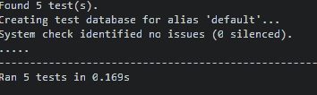

# Functional Testing

## Authentication

Description:

Ensure user is able to sign up to website.

Steps:

1. Click on [Register](https://satori-knowledgebase-f34b4f67eb41.herokuapp.com/accounts/signup/)
2. Fill in form
3. Click Sign Up

Expected:

User is signed up and success alert is displayed informing that they are signed in.

Actual:

User is signed up and success alert is displayed informing that they are signed in.

---
Description:

Ensure user is able to  log in once they are signed up to website.

Steps:

1. Click on [Login](https://satori-knowledgebase-f34b4f67eb41.herokuapp.com/accounts/login/)
2. Fill in form
3. Click Sign In
4. Optional select remember me

Expected:

User is signed in and success alert is displayed informing that they are signed in.

Actual:

User is signed in and success alert is displayed informing that they are signed in.

---

Description:

Ensure user is able to  log out once they are signed up to website.

Steps:

1. Click on [Logout](https://satori-knowledgebase-f34b4f67eb41.herokuapp.com/accounts/logout/)
2. Click Sign out

Expected:

User is signed out and success alert is displayed informing that they have been signed out.

Actual:

User is signed out and success alert is displayed informing that they have been signed out.

---

## Site admin

Description:

Ensure site admin is able to create a technique

Steps:

1. Click on [Login](https://satori-knowledgebase-f34b4f67eb41.herokuapp.com/accounts/login/)
2. Fill in form using admin logins
3. Click Sign In
4. Click on [Add Technique](https://satori-knowledgebase-f34b4f67eb41.herokuapp.com/video_post/)
5. Fill in form with technique details and select status as published
6. Click Create Technique

Expected:

A new technique is created and visible on the home page

Actual:

A new technique is created and visible on the home page.

---

Description:

Ensure site admin is able to edit a technique

Steps:

1. Click on [Login](https://satori-knowledgebase-f34b4f67eb41.herokuapp.com/accounts/login/)
2. Fill in form using admin logins
3. Click Sign In
4. Select any technique from the home page
5. Select edit technique button below video
6. Edit the form
7. Select edit form button at bottom of form

Expected:

The technique is updated

Actual:

The technique is updated

---

Description:

Ensure site admin is able to delete a technique

Steps:

1. Click on [Login](https://satori-knowledgebase-f34b4f67eb41.herokuapp.com/accounts/login/)
2. Fill in form using admin logins
3. Click Sign In
4. Select any technique from the home page
5. Select delete technique button below video
6. Select the delete technique button to confirm deletion

Expected:

The technique is deleted

Actual:

The technique is deleted

---

## Liked Techniques

Description:

A logged in user is able to view their liked techniques

Steps:

1. Click on [Login](https://satori-knowledgebase-f34b4f67eb41.herokuapp.com/accounts/login/)
2. Fill in form with login details.
3. Click sign in
4. Select [Liked Techniques](https://satori-knowledgebase-f34b4f67eb41.herokuapp.com/liked-techniques/)
5. View liked techniques

Expected:

Techniques that have been liked by the user are displayed

Actual:

Techniques that have been liked by the user are displayed

---

## User Interaction

Description:

A logged in user is able to like a Technique

Steps:

1. Click on [Login](https://satori-knowledgebase-f34b4f67eb41.herokuapp.com/accounts/login/)
2. Fill in form with login details.
3. Click sign in
4. Select any technique
5. Select the love heart button below the video

Expected:

If clicked once the technique is like the counter is updated and the icon changes to a filled in heart.

If clicked again the technique is un liked the counter is updated and the icon changes to a hollow heart.

Actual:

If clicked once the technique is like the counter is updated and the icon changes to a filled in heart.

If clicked again the technique is un liked the counter is updated and the icon changes to a hollow heart.

---

Description:

A logged in user is able to leave a comment on a Technique

1. Click on [Login](https://satori-knowledgebase-f34b4f67eb41.herokuapp.com/accounts/login/)
2. Fill in form with login details.
3. Click sign in
4. Select any technique
5. Fill in the comment form and submit

Expected:

A alert is displayed informed that the comment is awaiting approval.

Actual:

A alert is displayed informed that the comment is awaiting approval.

## Navigation Links

Each link on the navbar was tested to ensure that they are rendering the correct pages. Each link was selected to test that the correct pages were loading

- Home = index.html
- Liked Techniques = liked_techniques.html
- Logout = Sign out all auth page
- Register = Sign up all auth page
- Login = Sign in all auth page
- Add Technique = add_technique.html

All links were confirmed to be wokking as expected.

## Footer

All links were tested on the footer by clicking on the font awesome icons and that links were opened in new tabs.

All links opened as expected.

## Negative Testing

Tests were performed on all forms to ensure:

- All required fields are filled in to correct specification

## Unit Testing

Unit tests were created to test basic functionality of the Comment and Technique forms. These tests can be found in the tests.py file

## Accessibility

[Wave Accesibility Tool](https://wave.webaim.org/) was used to ensure that all pages were compliant with wave standards.

Some issues were found with the footer links that they were empty but they all contained value tags so it will be possible to confirm where these links lead.

## Validator Testing

All pages were run through the [w3 HTML Validator](https://validator.w3.org/). All tests were passed with some issues being found with the embedded youtube video. These were not edited as this is the way youtube specifies to use embeds.

All pages were run through the official Pep8 validator to ensure all code was pep8 compliant.

The django auto generated code for AUTH_PASSWORD_VALIDATORS were registering as lines too long. I could not find a way to shorten these lines but since they were auto generated and not my own code, I hope this is acceptable.

## Responsiveness

All pages were tested to ensure responsiveness from screen sizes 320px and up. This was monitored throughout development and the site took a mobile first approach. Responsiveness was tested on mobile devices and also on Chrome an Firefox.

Steps to test:

- Open browser and navigate to [Satori Knowledge base](https://satori-knowledgebase-f34b4f67eb41.herokuapp.com/)
- Open the developer tools (right click and inspect)
- Set to responsive and decrease width to 320px
- Click and drag the responsive window to maximum width

Expected:

Site is responsive on all screen sizes and elements adjust depending on screen size.

Actual:

Site adjusted as expected.